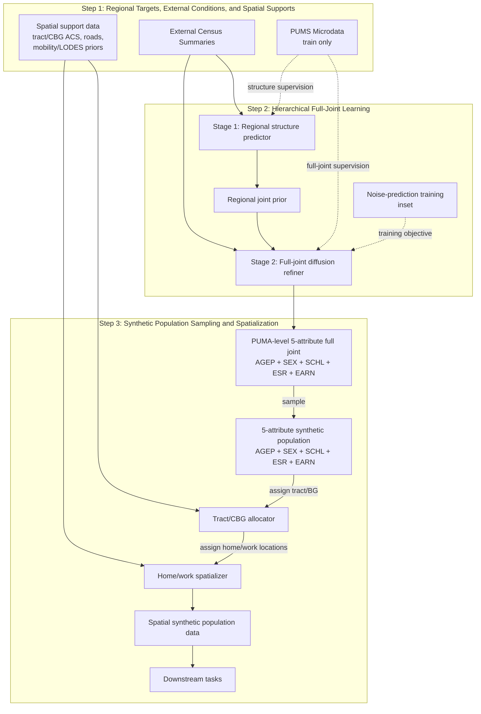

# Framework Layout Draft

这份草稿只服务于**逻辑确认**，不服务于最终排版。

当前主线已经不是旧的：

- 先生成 `4-attr`
- 再 `assign earnings`

而是直接学习并生成 **`PUMA-level 5-attribute full joint distribution`** 的层次化 joint 管线，并把采样后的个体进一步空间化为显式位置人口数据。当前主线固定为 `full-earn`，也就是：

- `AGEP`
- `SEX`
- `SCHL`
- `ESR`
- `EARN`

所以这张图现在最重要的不是“看起来像一个 diffusion 框架图”，而是要把下面这件事讲清楚：

> 我们先在 `PUMA` 层学习 `5-attribute full joint structure`，再通过 hierarchical refinement 得到完整的 regional full joint；随后从这个 learned full joint 采样 synthetic population，并将其展开到 tract/CBG 与显式空间位置，最终形成可用于下游任务的 spatial synthetic population data。

这意味着旧图里这三块都应该被移除：

- `Regional Context` 作为主对象
- `Conditional Earnings Head`
- `Assign Earnings`

## Recommended stage titles

我现在最推荐的图上 stage 标题是：

1. `Step 1: Regional Targets, External Conditions, and Spatial Supports`
2. `Step 2: Hierarchical Full-Joint Learning`
3. `Step 3: Synthetic Population Sampling and Spatialization`

正文里建议对应成展开版小节名：

- `Constructing Regional Targets, External Conditions, and Spatial Supports`
- `Learning the Hierarchical Full-Joint Distribution`
- `Sampling and Spatializing Synthetic Populations from the Learned Full Joint`

这组标题的优点是：

- 完全对齐当前主线
- `Step 2` 只负责学 **PUMA-level full joint**
- `Step 3` 负责把 learned full joint 变成最终的空间人口产品
- 不再把 `earnings` 写成后处理动作

## Terminology discipline

这张图里和 `Step 2` 相关的条件输入，术语必须统一。

- 图上的固定写法：`External Census Summaries`
- 解释性写法：`regional conditions`

两者指的是同一个东西。也就是说：

- `regional conditions = External Census Summaries`

因此在图里不要再混用：

- `census conditions`
- `census summaries`
- `external conditions`

更稳的做法是：

- 框名统一写 `External Census Summaries`
- 在正文或说明里再解释：它们就是 `Step 2` 的 regional conditions

## Spatial mainline alignment

用户已经明确了当前空间人口建模的主线，因此 framework 里 `Step 3` 不能再被画成一个抽象的 “sample persons” 终点，而应当对应下面这条产品化链。这里要把 **主产品** 和 **下游应用** 分开：

- 主产品：`spatial synthetic population data`
- 下游应用：从该空间人口产品继续做的分析或任务

`Step 3` 内部最合理的产品链，不应该全都写成动词短语，而应当拆成：

- **对象**：当前链条里被生成、被变换、被传递的东西
- **模块**：执行变换的模块
- **动作**：写在箭头上的动词

如果按这个语法来写，`Step 3` 最合理的是：

- `PUMA-level full joint`
- `synthetic population`
- `tract/BG-resolved population`
- `spatial synthetic population data`

中间对应的模块是：

- `Tract/CBG allocator`
- `Home/work spatializer`

箭头上的动作才写成：

- `sample`
- `assign tract/BG`
- `assign home/work locations`

具体到空间主线，它对应下面这条产品化链：

1. `PUMA -> tract/CBG allocation`
   - 用 `ACS` 作为 tract/CBG 结构锚点
   - 用 `mobility` 只做相对 residual ranking，不覆盖 ACS

2. `Tract-level household synthesis`
   - 生成 `household_id`
   - 把 person-level home 升级成 household-shared home

3. `Home spatialization`
   - `home tract -> explicit home point`
   - 当前最稳的空间结果，且已有外部验证

4. `Work spatialization`
   - `worker -> destination tract -> explicit work point`
   - 当前可以宣称 `work tract + commute shape` 有所改善
   - 但不能宣称 `OD` 已被解决

这意味着 framework 里最好的做法不是把这些全部画成四个并列大模块，也不是把动作直接写成结果框，而是把它们压成 `Step 3` 内部的一条更短的 **对象链**：

- `5-attribute synthetic population`
- `Spatial synthetic population data`

其中：

- `Tract/BG` 分配写在模块和箭头动作里，不单独保留大对象框
- `household` 作为空间化管线内部的重要机制保留，但不单独升格成主链对象

如果需要给读者进一步暗示 `home/work` 的差异，可以在 `Home/work spatializer` 内部用很轻的双分支表示：

- `home placement`
- `work placement`

但不要把 `OD modeling` 画成已经解决的核心主块。当前最稳的表达应该是：

- spatial population data is part of the main product
- home is the most mature spatial component
- work is included, but its origin-destination pairing remains a boundary rather than a solved claim

另外，图里还应体现两个重要科学区分：

- `home` 是 stock：人住在哪
- `work` 是 flow：worker 去哪个 destination tract，再在 destination tract 内落点

因此在图里不要把 home/work 画成完全对称的两个小盒子。更稳的做法是：

- `home placement` 作为成熟、可验证的主分支
- `work placement` 作为已纳入产品链、但仍有边界的次分支

## Step 2 input logic

`Step 2` 的输入关系最好只保留一套说法：

- `External Census Summaries -> Stage 1: Regional structure predictor`
- `External Census Summaries + Regional joint prior -> Stage 2: Full-joint diffusion refiner`

这里不要改写成：

- `census condition`
- `condition encoder`
- `external condition`

因为这些写法会让读者误以为是不同对象。当前图里最需要的是：

- 一个固定的输入对象：`External Census Summaries`
- 一个中间状态对象：`Regional joint prior`
- 一个最终学习模块：`Stage 2: Full-joint diffusion refiner`

## Draft 1: Logic-first flowchart



## Draft 2: Layout suggestion

建议改成**上下三层布局**，不要再用现在这张图的左中右流程图。

当前最该表达的不是：

- 左边是数据
- 中间是模型
- 右边是结果

而是：

- 顶层给出输入、监督和空间支持来源
- 中层作为主视觉区，展示 `hierarchical joint learning` 过程
- 底层展示从 learned full joint 到 spatial synthetic population data 的产品化链条

建议的上下结构是：

1. 顶层：Observed Inputs, Supervision, and Spatial Supports
   - `External Census Summaries`
   - `PUMS Microdata (train only)`
   - `Spatial support data`

2. 中层：Hierarchical Full-Joint Learning
   - `Stage 1: Regional structure predictor`
   - `Regional joint prior`
   - `Stage 2: Full-joint diffusion refiner`
   - 一个小的 `Noise-prediction training` inset

3. 底层：Sampling and Spatialization
   - `PUMA-level 5-attribute full joint`
   - `5-attribute synthetic population`
   - `Spatial synthetic population data`
   - 其中用较小模块表示：
     - `Tract/CBG allocator`
     - `Home/work spatializer`
   - 从最终产品再引出 `downstream tasks`

最关键的不是把框旋转一下，而是把图的**主语**改掉：

- 图的主角不再是 `regional context`
- 图的主角也不再是 `earnings head`
- 图的主角应该是 `hierarchical full-joint learning`

## What this draft fixes

相对于旧图，这张草稿明确修正了五件事：

1. `PUMS` 不是 inference input，而是 train-only supervision。
2. `earnings` 已经是 full joint 的一个维度，不再需要单独的 assignment branch。
3. `Step 2` 负责学习 `PUMA-level hierarchical full joint`，不再和 sampling 混写。
4. `Step 3` 不应停在抽样，而应通过小区域展开、household synthesis 与 home/work spatialization 落到 `spatial synthetic population data` 这个最终产品。
5. `downstream tasks` 应该从最终空间人口产品向外生长，而不是混进主训练链。
6. `work` 可以进主链，但 `OD pairing` 不能被画成已经解决的主模块。
7. 上下布局能自然消掉现在图里的多条斜向交叉箭头。
8. `Step 3` 里的框应尽量以对象或模块命名，动作写在箭头上，不再把 `allocation / synthesis / assignment` 直接混成结果框名。
9. `household` 可以在逻辑说明里保留，但不再单独升格成主链大框，以免削弱空间人口产品这条主线。

## Role discipline

这张图里每个元素只承担一种角色，不要混写。

- **对象**
  - `External Census Summaries`
  - `PUMS Microdata`
  - `Spatial support data`
  - `Regional joint prior`
  - `PUMA-level 5-attribute full joint`
  - `5-attribute synthetic population`
  - `Spatial synthetic population data`

- **模块**
  - `Stage 1: Regional structure predictor`
  - `Stage 2: Full-joint diffusion refiner`
  - `Tract/CBG allocator`
  - `Home/work spatializer`

- **动作**
  - `sample`
  - `assign tract/BG`
  - `assign home/work locations`

图里要遵守两条纪律：

1. 框里只放对象或模块，不放长句。
2. 动作只写在箭头上，不额外画成结果框。

## Shape guidance

建议的图形角色分工：

- `External Census Summaries`
  - summary bundle 或 compact histogram tiles
- `PUMS Microdata`
  - train-only table / record icon
- `Stage 1: Regional structure predictor`
  - 较小模块框
- `Regional joint prior`
  - 小 heatmap / table icon
- `Stage 2: Full-joint diffusion refiner`
  - Step 2 里最大的核心模块
- `Noise-prediction training`
  - 小 inset，不抢主视觉
- `PUMA-level 5-attribute full joint`
  - 更完整的 heatmap / probability table
- `5-attribute synthetic population`
  - final person-group icon
- `Tract/CBG allocator`
  - compact tract/CBG allocation module with ACS-anchored map cue and optional household cue
- `Home/work spatializer`
  - home/work-aware spatialization module with road support cue
- `Spatial synthetic population data`
  - mapped population product with explicit location cues

## Label guidance

图上的字要尽量短，不要把实现说明塞进框名里。

推荐保留的框名：

- `External Census Summaries`
- `PUMS Microdata`
- `Spatial support data`
- `Stage 1: Regional structure predictor`
- `Regional joint prior`
- `Stage 2: Full-joint diffusion refiner`
- `PUMA-level 5-attribute full joint`
- `5-attribute synthetic population`
- `Tract/CBG allocator`
- `Home/work spatializer`
- `Spatial synthetic population data`

推荐保留的箭头动作：

- `sample`
- `assign tract/BG`
- `assign home/work locations`

不推荐再出现的写法：

- `Conditional Earnings Head`
- `Assign Earnings`
- `Regional Context`
- `Person-level earnings model`
- 把 `spatialization` 画成图外注释或可选附加模块
- 把 `OD` 画成已经解决的独立主块

这些写法的问题分别是：

- 已经过时，不对齐当前主线
- 把 joint 里的一个维度误写成后处理
- 把空间产品误写成图外附加步骤
- 把当前仍有边界的问题过度宣称成已解决能力
- 把旧的内部概念误抬成主图主体
- 继续把图画成旧版本的方法分解
- 如果空间人口数据是产品，那么把 `spatialization` 放到主流程之外会直接削弱主线

## Noise-prediction wording

如果你还想在 `Step 2` 顶部保留 diffusion 训练提示，我建议保留，但只作为一个小 inset。

推荐：

- `Noise-prediction training`
或
- `Noise-prediction objective`

不建议只写：

- `Noise Prediction`

因为现在这张图的主问题不是“diffusion 有没有出现”，而是“diffusion 在整个 c2f 管线里承担什么角色”。  
所以它应该是辅助提示，不是整张图的主标题。

## Stage 2/3 icon brief

如果生成模型总把 `Stage 2` 和 `Stage 3` 画丑，问题通常不是 prompt 太短，而是**角色和图标语言没有锁死**。

这两层最稳的角色分工应该是：

- `External Census Summaries`
  - data object family
  - compact summary tiles / histogram cards
- `PUMS Microdata`
  - data object family
  - microdata card / record-table card
- `Spatial support data`
  - data object family
  - tract/BG map slab, road network hint, mobility/LODES support cards
- `Stage 1: Regional structure predictor`
  - model module family
  - small layered scientific predictor block with two internal plates
- `Regional joint prior`
  - latent/state family
  - floating translucent heatmap slab
- `Stage 2: Full-joint diffusion refiner`
  - model module family
  - visually dominant layered scientific architecture block with 3 to 4 nested internal planes
- `Noise-prediction training`
  - training inset family
  - compact objective badge with two tiny matrix tiles
- `5-attribute regional full joint`
  - output object family
  - resolved probability slab / structured heatmap plate
- `5-attribute synthetic population`
  - output object family
  - organized population card cluster / calm person-group result object
- `Tract/CBG allocator`
  - model/application module family
  - compact allocation block linking sampled persons to tract/BG geography
- `Home/work spatializer`
  - model/application module family
  - compact spatialization block linking people and road-constrained home/work locations
- `Spatial synthetic population data`
  - final output object family
  - mapped person/household/road-aware population product

这里最关键的不是再加更多 diffusion 术语，而是锁定三条视觉纪律：

1. `Stage 2` 必须有唯一主模块，不能让 predictor、prior、refiner 看起来一样重。
2. `Regional joint prior` 必须画成悬浮状态 slab，不能再像普通模块框。
3. `Stage 3` 必须明确分成 `sampling -> spatialization -> spatial product`，而不是只停在一个抽象的人群结果框。

## Prompt draft

下面直接给三版可复制内容：

- 一版用于**整图重画**
- 一版用于**只补强 Stage 2/3**
- 一版用于**基于现图局部修改**

### Full regeneration prompt

```text
Create a publication-quality scientific framework diagram for a synthetic population paper, one main method panel.

Figure role:
This panel should explain a hierarchical full-joint generation pipeline for regional synthetic population modeling. The figure must emphasize that the model first learns regional joint structure, then refines it into a 5-attribute full joint distribution, and finally samples synthetic populations directly from that learned full joint. It is not a generic diffusion poster, not a business workflow slide, and not a cartoon infographic.

Composition:
- vertical top-to-bottom layout
- three stacked stages
- compact top stage for observed inputs and supervision
- visually dominant middle stage for hierarchical joint learning
- compact bottom stage for final sampling
- clean white or very light gray background
- mild isometric hint and restrained pseudo-3D depth
- the eye should land on the middle learning stage first

Stage 1: Regional targets and external conditions
- show External Census Summaries as the primary inference input
- render census summaries as a compact bundle of demographic summary tiles or histogram cards
- show PUMS Microdata separately as train-only supervision
- render PUMS as a record-table card or microdata sheet, not as an inference input
- visually distinguish inference input and supervision using placement, dashed arrows, or lighter styling
- keep both data objects lighter and simpler than the model modules

Stage 2: Hierarchical joint distribution learning
- arrange this stage internally as: upper-left small predictor block, center floating prior slab, lower-center dominant refiner block, top-edge tiny training inset
- render Stage 1 regional structure predictor as a compact pseudo-3D scientific module with two internal plates and one small matrix cue
- render the regional joint prior as a thin translucent probability-table slab or floating heatmap plate, clearly lighter than any model block
- render Stage 2 full-joint diffusion refiner as the single largest architecture block in the whole figure
- the refiner should have 3 to 4 nested internal planes, shallow extrusion, crisp front face, soft shadow, and a visible central cavity or denoising stack
- make the refiner look like scientific machinery, not like a blank rectangle, not like a cartoon transformer, and not like a glowing sci-fi cube
- suggest diffusion or denoising using a few internal probability slices, tiny matrix tiles, or structured latent plates inside the refiner
- do not draw forward and reverse diffusion as a long external chain of many repeated arrows or boxes
- place a small noise-prediction training inset near the top as a compact objective badge with two tiny matrix tiles and one simple arrow
- let PUMS supervision enter the learning stage from the side with minimal arrow clutter
- keep hierarchy visible through object contrast and size, not through many crossing arrows
- do not show a conditional earnings head
- do not show a regional context block as the central visual anchor

Stage 3: Synthetic population sampling
- place one resolved 5-attribute regional full joint directly below the refiner
- render the full joint as a calm output object: a larger heatmap slab, probability-table plate, or structured distribution book with mild depth
- show one short downward arrow labeled sample
- render the final output as an organized 5-attribute synthetic population, preferably a neat cluster of person cards or human silhouettes with subtle attribute bands
- make the bottom stage read as sampling from the learned full joint, not as another model-learning stage
- keep the output objects calmer and more resolved than the middle learning stage
- do not show assign earnings as a separate action
- do not add a second model block in Step 3

Style requirements:
- publication-grade scientific infographic
- restrained blue-green, muted teal, warm sand, and light gray palette
- crisp geometry, subtle shadows, mild depth
- unified icon grammar: data objects as cards or tiles, model modules as layered pseudo-3D blocks, states as floating translucent slabs, outputs as calmer result objects
- elegant arrows with minimal crossing
- clean grouping boxes and stable negative space
- technically credible, visually restrained, and uncluttered
- keep the 3D effect restrained and publication-grade, never glossy or dramatic

Text handling:
- keep all in-figure text very short
- use module names and object names only
- do not render long text paragraphs
- do not include fake equations
- leave clean strips or empty space for later manual annotation if needed

Negative prompt:
- cartoon
- childish infographic
- dark background
- neon colors
- dashboard UI
- left-to-right corporate workflow slide
- generic machine learning poster
- fake equations
- overcrowded crossing arrows
- unreadable labels
- long text paragraphs
- repeated diffusion chains
- glowing sci-fi core
- particle explosion
- glossy 3D cube
- clipart brain or cloud icon
- regional context block as the central anchor
- person-level earnings branch
- conditional earnings head
- assign earnings arrow
```

### Stage 2/3 visual patch prompt

如果整体 prompt 已经基本能出图，但 `Stage 2` 和 `Stage 3` 仍然不够好看，最有效的做法通常不是重写整张图，而是单独补一段局部视觉补丁：

```text
Improve only the visual language of Stage 2 and Stage 3 while preserving the overall scientific composition and the three-step story.

Stage 2 visual patch:
- make the full-joint diffusion refiner the single dominant visual anchor of the figure
- redesign it as a layered scientific architecture block with 3 to 4 nested internal planes, shallow extrusion, crisp edges, soft shadows, and a visible central denoising stack
- redesign the regional structure predictor as a smaller supporting pseudo-3D block with two internal plates
- redesign the regional joint prior as a floating translucent heatmap slab, not as another module box
- redesign the noise-prediction training note as a tiny objective badge, clearly secondary
- express diffusion using restrained internal probability slices or matrix plates inside the refiner, not by drawing a long repeated forward-reverse diffusion chain
- reduce arrow clutter; the stage should read through hierarchy, size contrast, and object grammar

Stage 3 visual patch:
- redesign the 5-attribute regional full joint as a calm resolved probability slab with mild depth
- keep one short downward sample arrow only
- redesign the synthetic population output as an organized person-card cluster or clean human-group result object
- make Stage 3 look like a resolved sampling outcome rather than another model module

Hard limits:
- do not add a conditional earnings head
- do not add assign earnings as a separate step
- do not turn diffusion into a sci-fi vortex, glowing orb, or particle explosion
- do not flatten everything into identical rectangles
- do not add long text or fake formulas
```

### Local edit prompt for the current figure

```text
基于当前这张图做局部修改，重点提升 Step 2 和 Step 3 的视觉质量，同时把整体语义调整到当前 full-joint 主线。不要画成另一种商业风格，不要把 diffusion 画成花哨海报。

必须保留的内容：
1. 保留整张图的科研图风格、浅色背景、分步框架感。
2. 保留 Step 1 / Step 2 / Step 3 三段式结构。
3. 保留 diffusion 作为方法主线的一部分。
4. 保留轻微的伪 3D 层次感，不要退回纯平面流程图。

必须修改的文字和语义：
1. 把“Step2: Regional-Context Diffusion”改成“Step 2: Hierarchical Joint Distribution Learning”
2. 把“Step3: Synthetic Population Generation”改成“Step 3: Synthetic Population Sampling”
3. 删除“person-level earnings model”
4. 删除“Assign Earnings”
5. 删除任何把“Regional Context”作为中央主对象的写法
6. 最终结果明确改成“5-attribute synthetic population”

版式调整：
1. 不要再用左中右布局，改成上下三层布局。
2. 顶层放 Step 1：External Census Summaries 和 PUMS Microdata。
3. 中层放 Step 2，并把它做成整张图的主视觉区域。
4. Step 2 内部必须明确分成四种对象，不要再都画成普通矩形：
   - `Stage 1: Regional structure predictor`：较小的 layered scientific predictor block，双层 internal plates
   - `Regional joint prior`：悬浮的半透明 heatmap / probability slab
   - `Stage 2: Full-joint diffusion refiner`：整张图里最大的 layered architecture block，3 到 4 层 nested internal plates，shallow extrusion，soft shadow，中心有轻微 denoising stack
   - `Noise-prediction training`：顶部很小的 objective badge，不抢主视觉
5. 不要把 diffusion 画成长串前向/反向步骤，不要画成发光核心、旋涡、科幻球体；只允许通过 refiner 内部少量 probability slices 或 tiny matrix tiles 暗示 denoising / refinement。
6. 底层放 Step 3，并画成清楚的向下链条：
   - `5-attribute regional full joint`：较大的 resolved probability slab / heatmap plate，带轻微厚度
   - `sample`：只保留一条短的向下箭头
   - `5-attribute synthetic population`：整齐的人群结果对象或 person-card cluster，不要像第二个模型模块
7. 删除大部分斜向交叉箭头，尤其是当前从 Step 2 指向 Step 3 的多条斜箭头。
8. PUMS 只允许通过 supervision 方式进入 Step 2，不要看起来像 inference input。

限制：
- 不要新增 conditional earnings head
- 不要新增 assign earnings 相关图标或文字
- 不要新增 regional context 主块
- 不要在主图里强调 coarse 或 IPF 这些实现细节
- 不要把图改成商业流程图
- 不要把 3D 做成厚重、夸张、发亮的商业海报风
- 不要加入长句说明
- 不要把所有元素重新画成一样的矩形
- 如果文字不能准确渲染，就留空，后期手工加字
```

## Targeted edit brief for the current figure

如果你是基于当前这张图做局部修改，而不是整张重画，我建议直接按下面这组指令改：

1. 保留 scientific tone，不保留当前 left-to-right 构图。
2. 把三步改成上下堆叠：
   - 顶部 `Step 1`
   - 中部 `Step 2`
   - 底部 `Step 3`
3. 删除整块 `person-level earnings model`。
4. 删除所有 `Assign Earnings` 相关箭头和标签。
5. 删除 `Regional Context` 作为中央主对象的写法。
6. 把中间主区域改成真正的层次化 joint learning 结构：
   - `Stage 1: Regional structure predictor`
   - `Regional joint prior`
   - `Stage 2: Full-joint diffusion refiner`
   - 顶部小 inset：`Noise-prediction training`
7. 把底部结果区改成清楚的向下生成链：
   - `5-attribute regional full joint`
   - `sample`
   - `5-attribute synthetic population`
8. 删除当前图里大部分对角线交叉箭头。
9. `Step 3` 不要再出现任何“后处理 earnings”的视觉暗示，因为当前主线已经是直接生成 5-attribute full joint。
10. 不要在主图显著写出 `coarse` 或 `IPF`，这些放到正文或图注里，而不是放到主视觉层。
