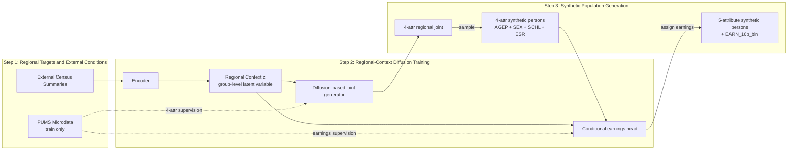

# Framework Layout Draft

这份草稿只服务于**逻辑确认**，不服务于最终排版。

核心目标：

- 保留 `diffusion` 作为方法主线
- 明确哪些是 `inference input`
- 明确哪些只是 `training supervision`
- 明确 `regional context` 是状态，不是模块
- 明确 `earnings` 是如何落到 synthetic persons 上的

## Recommended stage titles

我现在最推荐的图上 stage 标题是：

1. `Step 1: Regional Targets and External Conditions`
2. `Step 2: Regional-Context Diffusion Training`
3. `Step 3: Synthetic Population Generation`

这组标题的优点是：

- 和正文可以直接共享关键词
- `diffusion` 仍然保留在主线位置
- `regional context` 被明确抬到方法核心
- 第三步自然覆盖 joint generation、sampling 和 earnings assignment

正文里建议对应成展开版小节名：

- `Constructing Regional Targets and External Conditions`
- `Training the Regional-Context Diffusion Model`
- `Generating Synthetic Populations and Assigning Earnings`

这样图和文的关系会更稳：

- 图里：短标题
- 文里：展开标题
- 共用同一套核心词

## Draft 1: Logic-first flowchart



## Draft 2: Layout suggestion

建议做成三列，而不是旧图的三步工艺流程。核心不是去画 forward / reverse diffusion 的实现细节，而是把**输入角色、核心状态和生成结果**分开：

1. 左列：Observed Data
   - `External Census Summaries`
   - `PUMS Microdata (train only)`

2. 中列：Model
   - `Encoder`
   - `Regional Context`
   - `Diffusion-based joint generator`
   - `Conditional earnings head`

3. 右列：Generation
   - `4-attr regional joint`
   - `4-attr synthetic persons`
   - `5-attribute synthetic persons`

## What this draft fixes

相对于旧 framework，这张草稿明确修正了三件事：

1. `PUMS` 不是推理时输入，而是训练监督来源。
2. 真正的主输入是 `external census summaries`。
3. `earnings` 不是整区统一附加，而是先生成 4 个基础属性，再依据 `person attributes + regional context` 赋给 individual records。

## Role discipline

这张图里每个元素只承担一种角色，不要混写：

- **对象**
  - `External Census Summaries`
  - `PUMS Microdata`
  - `Regional Context`
  - `4-attr regional joint`
  - `4-attr synthetic persons`
  - `5-attribute synthetic persons`
- **模块**
  - `Encoder`
  - `Diffusion-based joint generator`
  - `Conditional earnings head`
- **动作**
  - `sample`
  - `assign earnings`

图里要遵守两条纪律：

1. 框里只放对象或模块，不放长句说明。
2. 动作只写在箭头上，不单独画成结果框。

## Shape guidance

建议的图形角色分工：

- `External Census Summaries`
  - summary bundle，而不是单一向量
- `PUMS Microdata`
  - record/table icon
- `Encoder`, `Diffusion-based joint generator`, `Conditional earnings head`
  - 模块框，同一风格
- `Regional Context`
  - latent state，不画成普通模块框
- `4-attr regional joint`
  - heatmap / joint-table icon
- `4-attr synthetic persons`
  - person-record icon
- `5-attribute synthetic persons`
  - final person-record icon

## Label guidance

图上的文字要尽量短，避免把动作、输入和结果压成一个长标签。

推荐保留的框名：

- `External Census Summaries`
- `PUMS Microdata`
- `Encoder`
- `Regional Context`
- `Diffusion-based joint generator`
- `Conditional earnings head`
- `4-attr regional joint`
- `4-attr synthetic persons`
- `5-attribute synthetic persons`

推荐保留的箭头动作：

- `sample`
- `assign earnings`

不推荐出现的写法：

- `Assign earnings using person attributes + regional context`
- `Conditional earnings model`
- `4-attr diffusion head`
- `Condition vector`

这些写法的问题分别是：

- 把动作和输入来源写在同一个框里
- 发明了不必要的中间对象
- 把主模型写得太像实现细节
- 把内部计算对象抬成主图主体

## Noise-prediction wording

如果你要在 Step 2 顶部保留那个 diffusion 训练小过程，我建议保留，但要把它明确成：

- **Step 2 的内部训练机制提示**
- 不是整个 stage 的主标题

这里最合适的写法取决于它放在哪里：

### 如果它是小 inset 的标题

推荐：

- `Noise-prediction training`
或
- `Noise-prediction objective`

不太建议只写：

- `Noise Prediction`

因为它有点太悬，读者不一定知道这是：

- 训练目标
- 还是整个 diffusion 过程

### 如果它写在箭头上

推荐：

- `predict noise`
或
- `denoise`

这里的原则是：

- 框名用名词
- 箭头用动作

### 和正文的对应句

如果图里保留这块，正文里最好也对应写成一句固定表达：

> The diffusion model is trained with the standard noise-prediction objective.

这样图和文就能完全对上：

- 图里：`Noise-prediction training` / `predict noise`
- 文里：`noise-prediction objective`

## Prompt draft

下面这版不是最终出图 prompt，而是基于 `scientific-figure-prompting` 模版整理出来的**第一版科研绘图 prompt 骨架**。它的作用是：

- 先固定构图逻辑
- 再控制视觉风格
- 避免把图重新画回“文字很多的旧流程图”

### Prompt structure

```text
Create a publication-quality scientific framework diagram for a geospatial synthetic population paper, one main method panel.

The figure should be a clean, rigorous research framework, not a cartoon, not a business infographic, and not a generic software flowchart.

Composition:
- horizontal left-to-right layout
- three main columns: observed data, model, generation
- one visually dominant central model block
- clean white or very light gray background

Stage 1: Observed data
- show one external census summary block as the primary inference input
- represent it as a bundle of demographic summary objects, such as compact histograms or summary tiles, not as raw person records
- show one separate PUMS microdata block as training-only supervision
- render PUMS as a record or table-like object
- visually distinguish inference input from train-only supervision

Stage 2: Model
- show an encoder module in the center-left
- show a highlighted regional context state in the center as the key latent anchor
- label this state as a shared region-level latent concept, but keep text short
- show one diffusion-based joint generator branch from the regional context
- show one smaller conditional earnings head branch from the regional context
- keep the diffusion-based joint generator visually dominant over the auxiliary earnings branch
- do not visualize forward and reverse diffusion as a long engineering pipeline

Stage 3: Generation
- show one 4-attribute regional joint distribution object as a heatmap or structured probability table
- show one sampling step that produces 4-attribute synthetic persons
- feed sampled persons and the regional context into the conditional earnings head
- show the final output as 5-attribute synthetic persons with age, sex, education, employment, and earnings
- represent assign earnings as an arrow action, not as a separate result box

Style requirements:
- publication-grade scientific infographic
- restrained blue-green and warm neutral palette
- crisp geometry, mild depth, subtle shadows
- clean grouping boxes and elegant arrows
- technically credible, visually restrained, no decorative clutter

Text handling:
- keep all in-figure text very short
- leave clean label strips or blank space for later manual annotation
- use module names, not sentences
- do not render long captions inside the figure

Negative prompt:
- cartoon
- childish infographic
- dark background
- neon colors
- dashboard UI
- fake equations
- overcrowded arrows
- long text paragraphs
- unreadable labels
- generic machine learning poster style
```

### Why this prompt is better than a one-paragraph prompt

这个结构比一整段 prompt 更稳，原因是：

1. 先固定 figure job  
   - 这是 main method panel，不是结果图，也不是 graphical abstract

2. 先固定 composition  
   - 先把三列结构钉住，再谈颜色和质感

3. stage-by-stage 写 visible objects  
   - 不写抽象概念堆叠，而是写“看到什么”

4. 单独限制 text handling  
   - 避免 AI 生成很多错误文字

5. negative prompt 单独列出  
   - 避免出成卡通、dashboard、商业海报

### Next step

如果下一步要真正生成框架图，我建议不要直接把上面这段原封不动丢给出图工具，而是再做一次收紧：

- 把每个 stage 的 visible objects 压成更短的 nouns
- 把需要保留的 5 到 8 个文字标签单独列出来
- 明确哪些字可以后期手工加，哪些必须出现在初稿里
