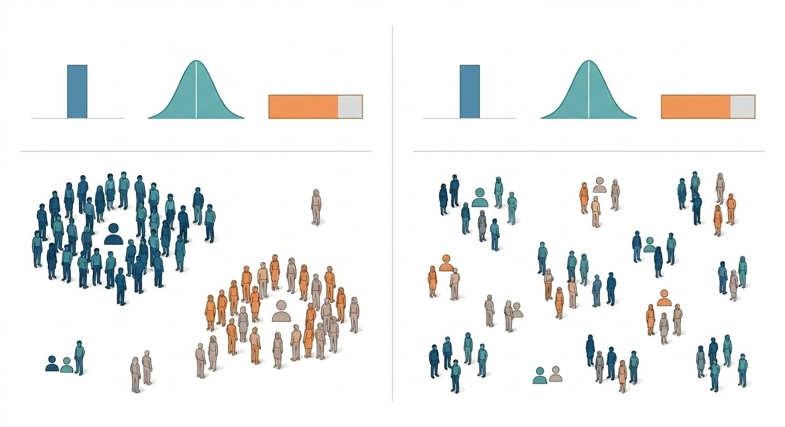

# Practice Presentation Draft

## Core Message

Average data do not tell us how a population is actually structured. What matters is not only how many people belong to each group, but also which traits appear together.

## Opening Slide



## Opening

If two neighborhoods have the same averages, for example, the same income, we often assume they are basically the same. But that is often wrong. Similar averages can hide features of very different populations. My research asks how we can recover those hidden differences from census data.

## Plain-Language Explanation

Most census summaries tell us totals. They tell us how many people are young, how many people have high income, and how many people are employed. But they do not tell us which traits occur together. For example, a region may have many high-income residents and many highly educated residents, but that still does not tell us whether these people are both high-income and highly educated. That hidden co-occurrence is what I want to recover.

## What My Research Does

I study synthetic population generation. The goal is to reconstruct realistic local population structure from census summaries. Instead of  matching variables one by one, I try to learn how multiple demographic traits go together within each region.

## Main Finding

My main finding is that local population structure varies much more than average data suggest. Places that look similar in their totals can still have very different internal patterns. I also find that the model becomes much more accurate when it is given information about how traits are related, not just simple totals.

## Why It Matters

This matters because planning and policy often rely on population models. If those models only match averages, they can miss real local differences and the needs of specific groups. Better synthetic populations can support more realistic planning, transportation analysis, and policy decisions.

## Closing

So the main point is simple: averages are not enough if we want to understand real populations. If we want better models of cities and communities, we need to know not just how many people belong to each group, but which traits appear together. Thank you.

## 3-4 Minute Structure

1. Start with the idea that two regions can share the same averages but still be very different.
2. Explain why averages alone cannot reveal which traits occur together.
3. Introduce my research as an attempt to recover that hidden structure from census summaries.
4. State the main finding: regional dependence is heterogeneous, and richer constraints improve recovery.
5. End by explaining why this matters for planning, policy, and understanding inequality.

## Memory Cards

### 1. Opening

Anchors:
- `same averages`
- `same place?`
- `often wrong`
- `hidden differences`

Prompt sentence:

```text
If two neighborhoods have the same averages, we often assume they are basically the same. But that is often wrong. Similar averages can hide very different populations. My research asks how we can recover those hidden differences from census data.
```

### 2. Problem

Anchors:
- `totals`
- `not co-occurrence`
- `same people?`
- `hidden structure`

Prompt sentence:

```text
Most census summaries tell us totals. But they do not tell us which traits occur together. For example, they do not tell us whether the same people are both high-income and highly educated. That hidden co-occurrence is what I want to recover.
```

### 3. What I Do

Anchors:
- `synthetic population`
- `from census summaries`
- `not one by one`
- `traits go together`

Prompt sentence:

```text
I study synthetic population generation. My goal is to recover realistic local population structure from census summaries. Instead of matching variables one by one, I try to learn how multiple demographic traits go together within each region.
```

### 4. Main Finding

Anchors:
- `local structure varies more`
- `same totals, different patterns`
- `relationships, not just totals`
- `more accurate`

Prompt sentence:

```text
My main finding is that local population structure varies much more than average data suggest. Places that look similar in their totals can still have very different internal patterns. I also find that the model becomes much more accurate when it is given information about how traits are related, not just simple totals.
```

### 5. Closing

Anchors:
- `main point is simple`
- `averages are not enough`
- `not just how many`
- `which traits appear together`

Prompt sentence:

```text
So the main point is simple: averages are not enough if we want to understand real populations. If we want better models of cities and communities, we need to know not just how many people belong to each group, but which traits appear together. Thank you.
```


补充一个情景，说example，把主要的findings给